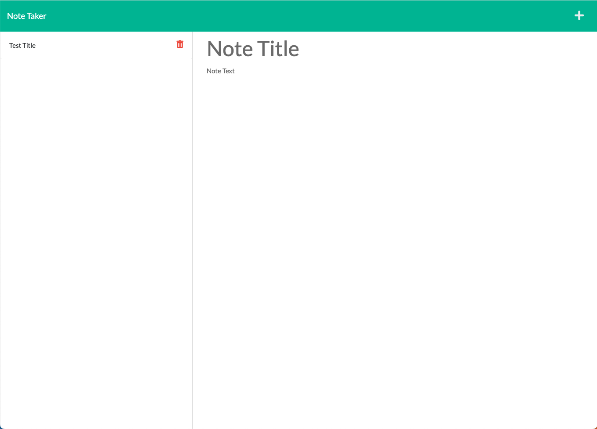

# Welcome to note-taker 👋

> note taking app using express

### ✨ [Demo](https://polar-waters-55674.herokuapp.com/notes)

### Screenshot

## Author

👤 **Zack Levin**

* Twitter: [@TheRealPlanZ](https://twitter.com/TheRealPlanZ)
* Github: [@TheRealPlanZ](https://github.com/TheRealPlanZ)

## Show your support

Give a ⭐️ if this project helped you!

***
_This README was generated with ❤️ by [readme-md-generator](https://github.com/kefranabg/readme-md-generator)_